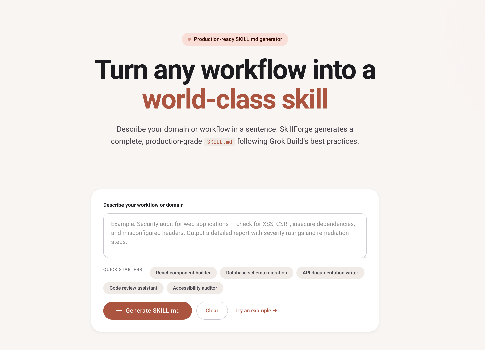

# SkillForge

> **This is a free, open-source template.** Use it however you want — for your own projects, your portfolio, your startup, or your clients. No attribution required, but a ⭐ is always appreciated!



A beautiful, client-side web tool that turns any workflow description into a production-grade `SKILL.md` file. Built with Astro and Tailwind CSS.

---

## What is this?

This template gives you a ready-to-use landing page with an interactive tool baked in. Visitors describe a workflow or domain, click a button, and get a complete, formatted `SKILL.md` they can copy or download instantly. Everything runs in the browser — no backend, no API keys, no hosting costs.

## Quick Start

```bash
# 1. Clone the repo
git clone https://github.com/noCode-Human/skillforge.git
cd skillforge

# 2. Install dependencies
npm install

# 3. Start the dev server
npm run dev

# 4. Open http://localhost:4321 in your browser
```

To build for production:

```bash
npm run build
```

Static files are output to `./dist/` — ready to drop on Vercel, Netlify, GitHub Pages, Cloudflare Pages, or any static host.

---

## Features included

- **Instant generation** — Describe any workflow and get a tailored SKILL.md in seconds
- **Domain detection** — Automatically figures out the domain (code, design, security, DevOps, etc.) and action type
- **Syntax-highlighted preview** — Beautiful markdown preview with dark-mode code styling
- **Copy & download** — One-click copy to clipboard or download as `SKILL.md`
- **Recent history** — Saves generated skills to `localStorage` for quick access
- **Material You design** — Clean, warm aesthetic with smooth animations
- **Fully responsive** — Works great on mobile, tablet, and desktop
- **Zero backend** — Everything runs client-side; host it anywhere for free

---

## Make it yours

Here are the easiest ways to customize this template:

| File | What to change |
|------|----------------|
| `src/pages/index.astro` | Hero text, brand name, colors, button labels, footer links |
| `src/styles/global.css` | Color palette (primary, secondary, surface, etc.) |
| `src/layouts/Layout.astro` | Page title, meta description, favicon, fonts |
| `public/favicon.svg` | Your own logo/icon |
| `astro.config.mjs` | Add your own domain, base path, or integrations |

### Tips to take it further

- **Hook up a real AI** — Replace the client-side generator with an API call to OpenAI, Claude, Grok, or Ollama for truly intelligent SKILL.md generation
- **Add more domains** — Extend `DOMAIN_PATTERNS` and `ACTION_PATTERNS` in the inline script to cover your niche
- **Export more formats** — Add PDF, DOCX, or JSON export alongside markdown
- **Add authentication** — Let users save skills to a database and sync across devices
- **Dark mode toggle** — The color tokens are already set up; add a theme switcher
- **SEO & social cards** — Add Open Graph and Twitter Card meta tags for better sharing
- **Analytics** — Drop in Plausible, Fathom, or Google Analytics to see what people generate most
- **Custom URL sharing** — Encode the prompt in the URL hash so users can share direct links to generated skills

---

## Tech stack

- [Astro](https://astro.build) — Fast static site framework
- [Tailwind CSS v4](https://tailwindcss.com) — Utility-first styling
- Vanilla JavaScript — Zero runtime dependencies

---

## License

MIT — use it, modify it, sell it, whatever. It's yours.

---

*Built by [Rachel noCode](https://github.com/rachel-nocode) for the [noCode Human](https://github.com/noCode-Human) community.*
